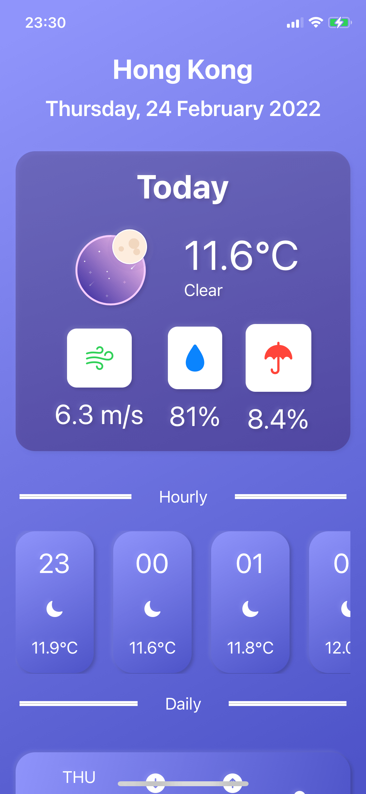
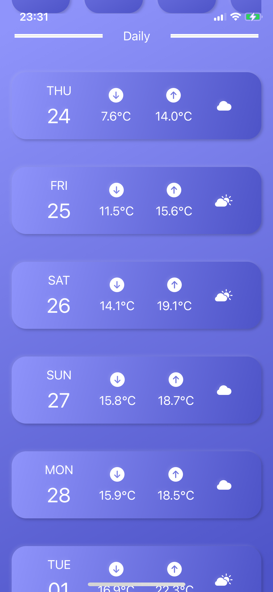

# HKWeather App

HKWeather App is designed to show current weather forecast info of Hong Kong, by using SwiftUI, Lottie Animations and the OpenWeatherMap API.

## Getting Started
- Create an account from OpenWeatherMap API ([link](https://home.openweathermap.org/users/sign_in)) 

- Choose the API key to use for this app from [here](https://home.openweathermap.org/api_keys)

- Go to ./HKWeather/Networking/WeatherApi.swift and replace your api key with the placeholder.

- Add the lottie dependency (https://github.com/airbnb/lottie-ios.git) into Xcode through Swift Package Manager

- Run and test

## Screenshots

